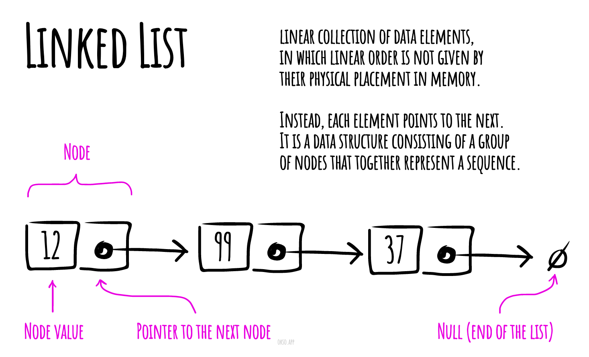

# Singly Linked List

A linked list is a linear collection of data elements, in which linear order is not given by their physical placement in
memory. Instead, each element points to the next. A drawback of linked lists is that access time is linear. Faster
access, such as random access, is not feasible. Arrays have better cache locality as compared to linked lists.

## Complexities

### Time Complexity

| Access | Search | Insertion | Deletion |
|:------:|:------:|:---------:|:--------:|
|  O(n)  |  O(n)  |   O(1)    |   O(n)   |

### Space Complexity

O (n)

## References

- [Wikipedia](https://en.wikipedia.org/wiki/Linked_list)
- [YouTube](https://www.youtube.com/watch?v=njTh_OwMljA&index=2&t=1s&list=PLLXdhg_r2hKA7DPDsunoDZ-Z769jWn4R8)

# Doubly Linked List

A doubly linked list is a linked data structure that consists of a set of sequentially linked records called nodes. Each
node contains two fields, called links, that are references to the previous and to the next node in the sequence of
nodes.

While adding or removing a node in a doubly linked list requires changing more links than the same operations on a
singly linked list, the operations are simpler and potentially more efficient (for nodes other than first nodes) because
there is no need to keep track of the previous node during traversal or no need to traverse the list to find the
previous node, so that its link can be modified.

## Complexities

## Time Complexity

| Access | Search | Insertion | Deletion |
| :----: | :----: | :-------: | :------: |
|  O(n)  |  O(n)  |   O(1)    |   O(n)   |

### Space Complexity

O(n)

## References

- [Wikipedia](https://en.wikipedia.org/wiki/Doubly_linked_list)
- [YouTube](https://www.youtube.com/watch?v=JdQeNxWCguQ&t=7s&index=72&list=PLLXdhg_r2hKA7DPDsunoDZ-Z769jWn4R8)