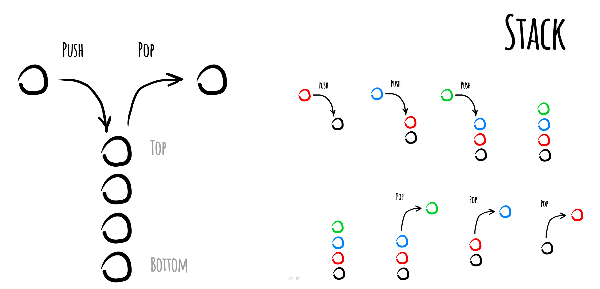

# Stack

A stack is an abstract data structure that serves as a collection of elements, with two principal operations:

* **push**, which adds an element to the collection.
* **pop**, which removes the most recently added element that was not yet removed.

The order in which elements come off a stack gives rise to its alternative name, LIFO (last in, first out).

Simple representation of a stack runtime with push and pop operations:

## Implementation notes

The nature of Stack and Linked List is kinda close to each other, that's why we usually implement the stack via a linked
list (which is what we have done in this project).

## References

- [Wikipedia](https://en.wikipedia.org/wiki/Stack_(abstract_data_type))
- [YouTube](https://www.youtube.com/watch?v=wjI1WNcIntg&list=PLLXdhg_r2hKA7DPDsunoDZ-Z769jWn4R8&index=3&)
